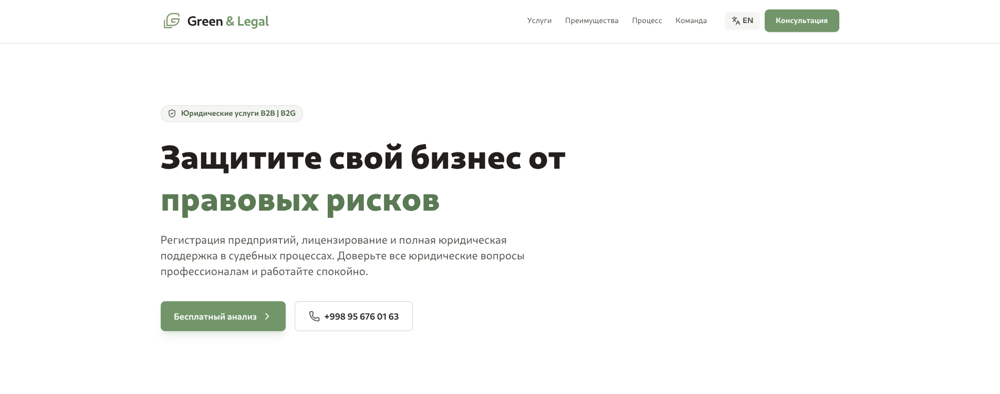
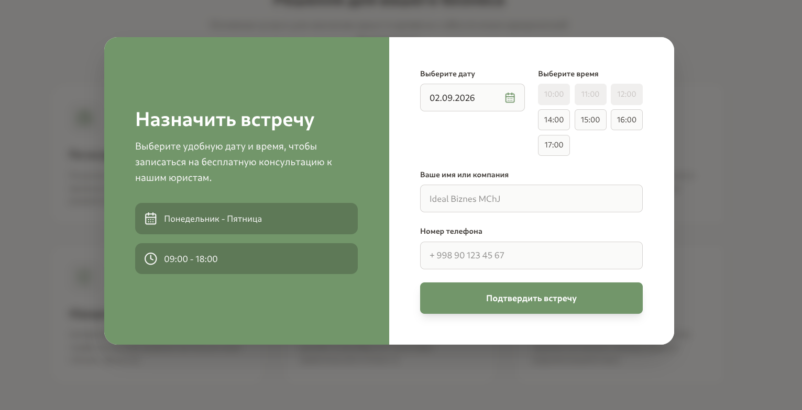
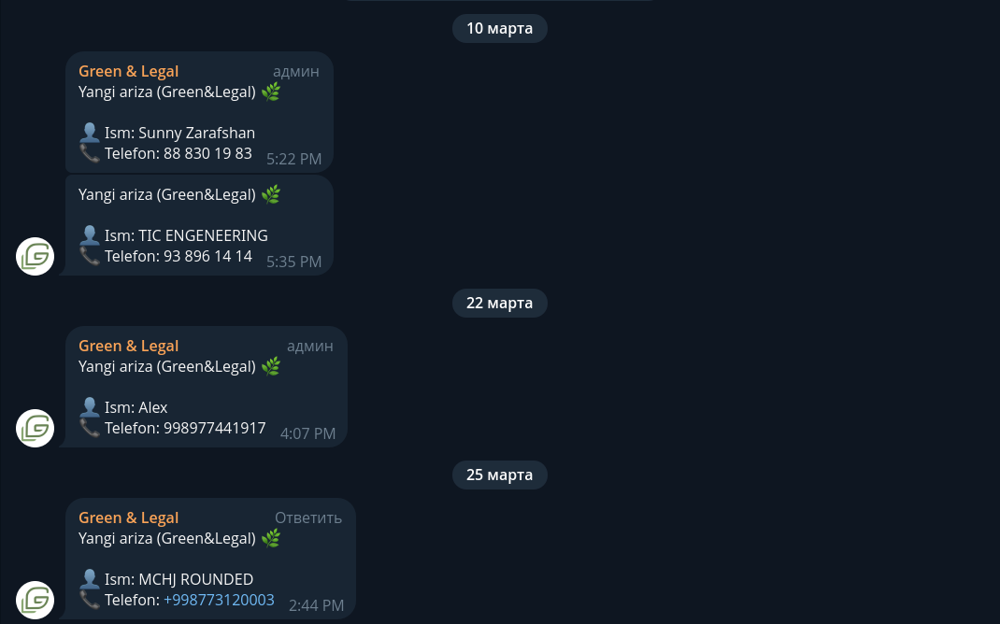

# 🌿 Green&Legal - Yuridik Firma Landing Sahifasi

**Green&Legal** — bu yuridik firmalar va advokatlar uchun maxsus ishlab chiqilgan zamonaviy, tezkor va to'liq moslashuvchan (responsive) landing page. Loyiha mijozlarni jalb qilish, xizmatlarni taqdim etish va arizalarni to'g'ridan-to'g'ri Telegram botga yuborish imkoniyatini beradi.

 


## ✨ Asosiy Xususiyatlar

* **⚡ Zamonaviy Texnologiyalar:** React + Vite orqali juda tez ishlaydi.
* **🌍 Language** O'zbek va Rus tillarini qo'llab-quvvatlaydi (bir tugma orqali almashish).
* **📱 To'liq Responsive:** Mobil, planshet va kompyuterlarda ideal ko'rinadi.
* **📩 Telegram Integratsiyasi:** Saytdagi formadan yuborilgan arizalar darhol sizning Telegram botingizga kelib tushadi. <br><br>
        

* **🎨 Zamonaviy Dizayn:** Tailwind CSS yordamida Premium uslubidagi dizayn.
* **✨ Animatsiyalar:** Framer Motion yordamida silliq (smooth) va chiroyli animatsiyalar.

## 🛠 Texnologiyalar

Loyiha quyidagi texnologiyalar asosida qurilgan:

* [React](https://reactjs.org/) (Vite) - Frontend kutubxonasi.
* [Tailwind CSS](https://tailwindcss.com/) - Stillar va dizayn uchun.
* [Framer Motion](https://www.framer.com/motion/) - Animatsiyalar uchun.
* [Lucide React](https://lucide.dev/) - Zamonaviy ikonka to'plami.
* Telegram Bot API - Arizalarni qabul qilish uchun. 

## 🚀 O'rnatish va Ishga Tushirish

Loyihani kompyuteringizga yuklab olish va ishga tushirish uchun quyidagi qadamlarni bajaring:

### 1. Repozitoriyani klonlash
Terminalni oching va quyidagi buyruqni yozing:

```bash
git clone [https://github.com/kamalovicdev-sys/yuridik-landing.git](https://github.com/kamalovicdev-sys/yuridik-landing.git)
cd yuridik-landing
